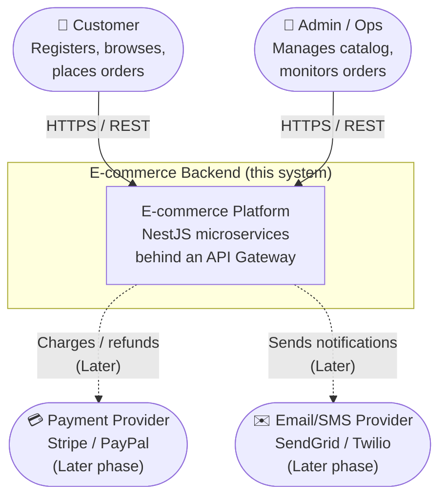

# 01 — System Context (C4 Level 1)

The highest-level view: who uses the system and what external systems it touches.

## Actors

| Actor               | Description                                            | Phase   |
| ------------------- | ------------------------------------------------------ | ------- |
| **Customer**        | End user. Registers, authenticates, browses, orders.   | Phase 1 |
| **Admin / Ops**     | Manages products and inventory, observes orders.        | Phase 1 |
| **Payment Provider**| External PSP (Stripe/PayPal). Charges and refunds.      | Later   |
| **Email/SMS Provider**| External provider for outbound notifications.         | Later   |

## System responsibilities

- Authenticate users and issue tokens.
- Serve a product catalog with stock information.
- Accept and manage the lifecycle of orders.
- (Later) Take payment and notify customers of status changes.

## Trust boundary

Everything inside the boundary is private. Only the **API Gateway** is reachable from the public
network. External providers are reached **outbound only**, over TLS, with credentials from the
secret store.

See the next level down: [Container Diagram](02-container-diagram.md).
