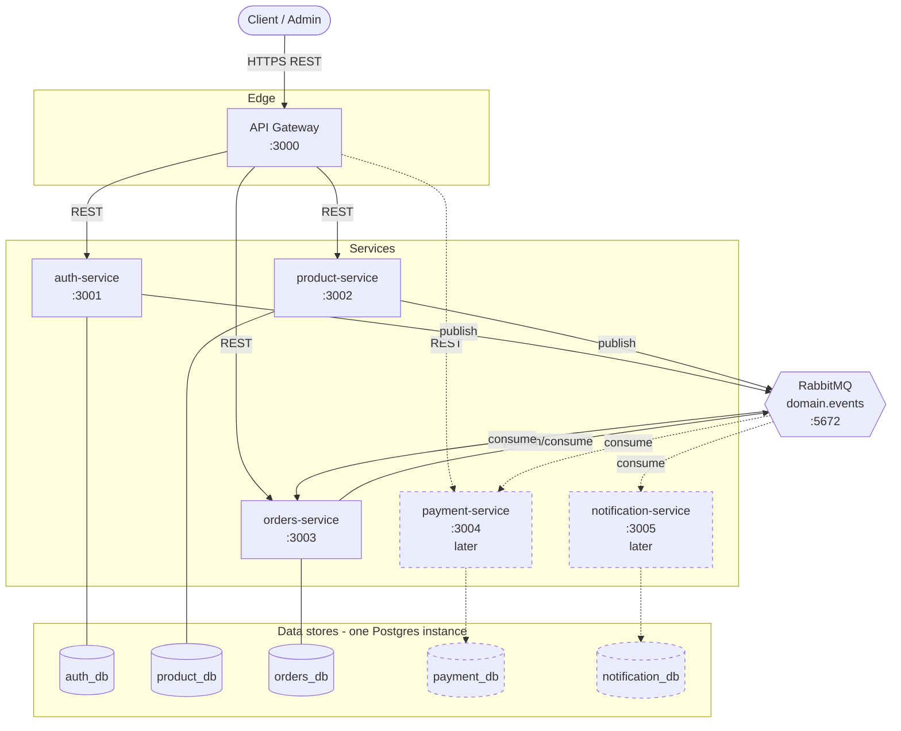

# 02 — Container Diagram (C4 Level 2)

The runtime building blocks and how they connect.

## Containers

| Container              | Tech            | Purpose                                                | Phase |
| ---------------------- | --------------- | ------------------------------------------------------ | ----- |
| API Gateway            | NestJS          | Auth validation, routing, rate limit, request shaping  | 1     |
| auth-service           | NestJS + Prisma | Identity, tokens, RBAC                                  | 1     |
| product-service        | NestJS + Prisma | Catalog, categories, stock                             | 1     |
| orders-service         | NestJS + Prisma | Cart, orders, order items, lifecycle                   | 1     |
| payment-service        | NestJS + Prisma | Payments, refunds, saga participant                    | Later |
| notification-service   | NestJS + Prisma | Event-driven outbound notifications                    | Later |
| PostgreSQL             | Postgres 16     | One instance, one logical DB per service               | 1     |
| RabbitMQ               | RabbitMQ 3.13   | Topic exchange for domain events                       | 1     |

## Key relationships

- **Client → Gateway**: the only public path. TLS terminates here.
- **Gateway → Services**: synchronous REST inside the private network.
- **Service ↔ Postgres**: each service connects only to its own database.
- **Service ↔ RabbitMQ**: publish/subscribe to domain events; the decoupling backbone.

## What is NOT allowed

- A service connecting to another service's database. ❌
- A service calling another service's DB-level objects. ❌
- Long synchronous chains (gateway → A → B → C). ❌ Prefer events.

Continue to [Communication Patterns](03-communication-patterns.md).
