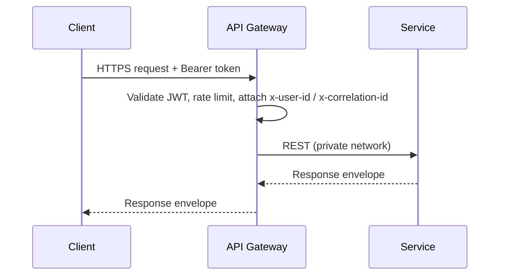
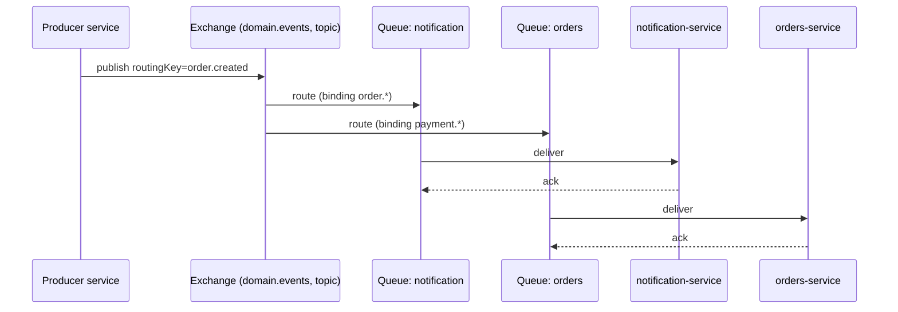

# 03 — Communication Patterns

Two patterns, used deliberately. See principle #2 in
[Architecture Principles](../00-overview/04-architecture-principles.md).

## A. Synchronous — REST behind the gateway

Used when the caller needs an immediate answer.

**Rules**
- Only the gateway calls services from outside; services may call each other sync **only one hop**.
- Every sync call has a **timeout** (default 3s) and **retry with backoff** for idempotent reads.
- Identity is forwarded as signed headers (`x-user-id`, `x-user-roles`), never re-parsed downstream.
- Failures propagate as the standard error envelope with an HTTP status.

### When a service must ask another service (sync)
Example: `orders-service` validates product price/stock at checkout by calling `product-service`.
Wrap in a **circuit breaker**; if open, fail the checkout fast with a clear error rather than hang.

## B. Asynchronous — RabbitMQ domain events

Used to broadcast facts. Producers don't know or care who consumes.

**Rules**
- One **topic exchange**: `domain.events`. Routing key = event name (`order.created`).
- Each consumer owns a **named, durable queue** bound with routing-key patterns.
- Messages are **persistent**; consumers **manual-ack** after successful handling.
- Handlers are **idempotent** (dedupe by `eventId`). Failures retry, then dead-letter.
- Reliable publish uses the **outbox pattern** (see Error Handling doc).

## Choosing between them

| Need                                            | Pattern         |
| ----------------------------------------------- | --------------- |
| "Give me the current value of X"                | Sync REST       |
| "Is this token valid?"                          | Sync REST (or gateway-local verify) |
| "X just happened, others may care"              | Async event     |
| "Update my local read model when X changes"     | Async event     |
| "Run a multi-service workflow with rollback"    | Async Saga (events + compensation) |

## Abstraction for swappability

Services publish/consume through an `@app/messaging` interface — not RabbitMQ APIs directly. This
keeps the **Kafka migration** (later) a library change, not a domain change. See
[Shared Libraries](05-shared-libraries.md) and [Kafka & K8s (later)](../05-infrastructure/04-kafka-k8s-later.md).
