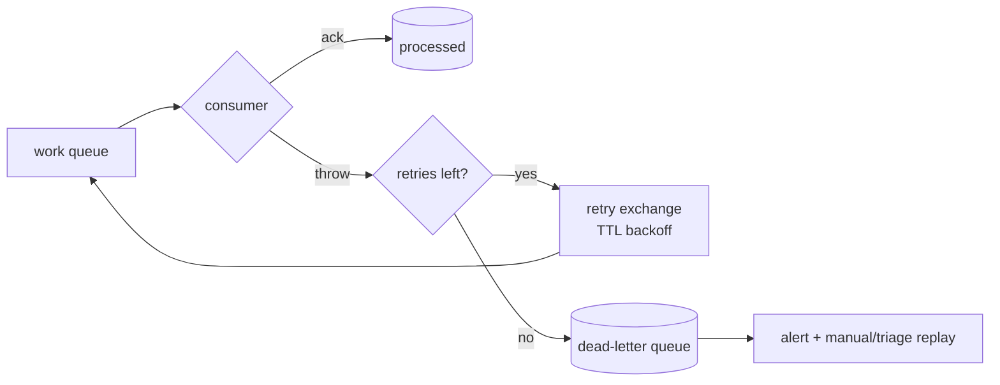

# 07 — Error Handling & Resilience

How the system behaves when things go wrong. Realizes principle #4 ("design for failure").

## REST error envelope

A global NestJS exception filter maps all errors to one shape:

```jsonc
{
  "error": {
    "code": "ORDER_NOT_FOUND",       // stable machine code (SCREAMING_SNAKE)
    "message": "Order abc not found", // human-readable
    "details": []                     // optional field-level validation errors
  },
  "meta": { "correlationId": "..." }
}
```

| HTTP | When                                   | Example `code`           |
| ---- | -------------------------------------- | ------------------------ |
| 400  | Validation / malformed input           | `VALIDATION_FAILED`      |
| 401  | Missing/invalid token                  | `UNAUTHENTICATED`        |
| 403  | Authenticated but not allowed          | `FORBIDDEN`              |
| 404  | Resource not found                     | `ORDER_NOT_FOUND`        |
| 409  | Conflict / invalid state transition    | `INVALID_ORDER_STATE`    |
| 422  | Business rule violation                | `INSUFFICIENT_STOCK`     |
| 429  | Rate limit exceeded                    | `RATE_LIMITED`           |
| 503  | Downstream dependency unavailable      | `DEPENDENCY_UNAVAILABLE` |

Error codes are part of the API contract (defined in `@app/contracts`).

## Synchronous resilience

| Concern        | Default policy                                                        |
| -------------- | -------------------------------------------------------------------- |
| Timeout        | 3s per inter-service call                                            |
| Retry          | Idempotent reads only: 2 retries, exponential backoff + jitter      |
| Circuit breaker| Open after N consecutive failures; fail fast while open             |
| Bulkhead       | Bounded concurrency per downstream to avoid resource exhaustion     |
| Fallback       | Return cached/last-known value where acceptable; else explicit 503  |

## Asynchronous resilience (RabbitMQ)



- **Manual ack**: a message is acked only after the handler succeeds.
- **Retries with backoff**: failed messages go to a delay/retry exchange (TTL), then re-queued.
  Cap at N attempts (default 5).
- **Dead-letter queue**: exhausted messages land in a DLQ for inspection and replay.
- **Idempotency**: handlers dedupe by `eventId` (a `processed_events` table or cache). Receiving a
  duplicate is a no-op.
- **Poison messages**: malformed payloads (fail validation) go straight to DLQ, not retried.

## Reliable publishing — Outbox pattern

To avoid "state saved but event lost" (or vice-versa):

```mermaid
sequenceDiagram
    participant S as Service
    participant DB as Postgres (service db)
    participant REL as Outbox relay
    participant MQ as RabbitMQ

    S->>DB: BEGIN; write aggregate + insert outbox row; COMMIT
    REL->>DB: poll unsent outbox rows
    REL->>MQ: publish event
    MQ-->>REL: confirm
    REL->>DB: mark outbox row sent
```

- The state change and the outbox row are written in the **same DB transaction** → atomic.
- A relay (in-process poller or CDC later) publishes and marks rows sent.
- Combined with consumer idempotency, this gives **at-least-once** delivery with no lost events.

## Transactions & consistency

- Within a service: standard ACID transactions (Prisma `$transaction`).
- Across services: **eventual consistency** via events; multi-step workflows use a **Saga** with
  compensating actions — see [Order ↔ Payment Saga](../03-flows/04-order-payment-saga.md).

## Validation

- All inbound DTOs validated with `class-validator` (whitelist + forbid unknown props).
- All inbound event payloads validated against their `@app/contracts` schema before handling.
