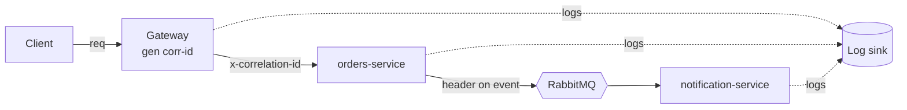

# 08 — Observability

Logs, metrics, traces, and health — built into every service via `@app/observability`.

## Correlation id

- The gateway generates an `x-correlation-id` (uuid) per request if absent.
- It is forwarded on every downstream REST call and copied into event message headers.
- Every log line includes it. One id ties together gateway → service → event consumer.

## Logging

- Structured **JSON** via `nestjs-pino`.
- Standard fields: `timestamp`, `level`, `service`, `correlationId`, `userId?`, `msg`, `context`.
- **No secrets / PII** in logs (passwords, tokens, full card data — redacted by serializers).
- Levels: `error` (actionable), `warn` (degraded), `info` (lifecycle/business milestones),
  `debug` (dev only).

## Metrics (Prometheus-ready)

| Metric                              | Type      | Labels                  |
| ----------------------------------- | --------- | ----------------------- |
| `http_requests_total`               | counter   | service, route, status  |
| `http_request_duration_seconds`     | histogram | service, route          |
| `rabbitmq_messages_consumed_total`  | counter   | service, queue, result  |
| `rabbitmq_message_processing_seconds`| histogram| service, queue          |
| `outbox_pending_rows`               | gauge     | service                 |
| `db_query_duration_seconds`         | histogram | service                 |

Exposed at `/metrics` on each service (scraped in K8s phase; available locally too).

## Tracing (later, but designed now)

- Correlation id is the minimum viable trace today.
- Later: OpenTelemetry SDK in `@app/observability`, exporting spans to an OTLP collector
  (Jaeger/Tempo). The correlation id maps to the trace id. No domain-code changes required.

## Health checks

Each service exposes (via `@nestjs/terminus`):

| Endpoint        | Checks                                  | Used by                        |
| --------------- | --------------------------------------- | ------------------------------ |
| `/health/live`  | process is up                           | container liveness probe       |
| `/health/ready` | DB reachable + broker connection up     | readiness / load-balancer gate |

## Alerting (conceptual for Phase 1)

- DLQ depth > 0 → alert (a message failed all retries).
- `outbox_pending_rows` rising → relay stuck.
- 5xx rate or p99 latency over threshold → alert.
- Readiness flapping → dependency problem.
