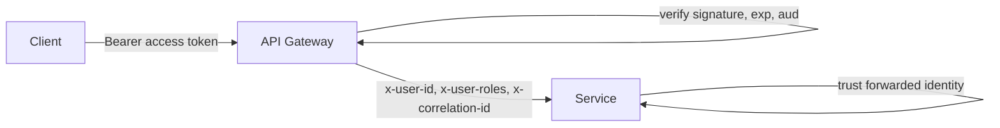

# 09 — Security & AuthN/AuthZ

## Identity model

- `auth-service` is the **only** issuer of tokens and the system of record for users, roles.
- Tokens are **JWT**, signed **RS256** (asymmetric):
  - `auth-service` holds the **private key** and signs.
  - The gateway (and any service) verifies with the **public key** — no shared secret to leak.
- Two tokens:
  - **Access token** — short-lived (15 min), sent as `Authorization: Bearer`.
  - **Refresh token** — long-lived (7 days), opaque-ish JWT, stored hashed server-side, rotated on use.

### Access token claims

```jsonc
{
  "sub": "user-uuid",
  "email": "jane@example.com",
  "roles": ["customer"],
  "iss": "auth-service",
  "aud": "ecommerce-api",
  "iat": 1750000000,
  "exp": 1750000900,
  "jti": "token-uuid"
}
```

## Where validation happens



- **Gateway** verifies the JWT signature/expiry/audience on every request (using the public key).
- It strips the raw token and forwards **signed identity headers** (`x-user-id`, `x-user-roles`).
- Downstream services **trust the gateway** within the private network and authorize via
  `RolesGuard` against the forwarded roles. (Services can also verify the JWT directly in dev.)

> The private network is a trust boundary. In the K8s phase this is hardened with mTLS / network
> policies so only the gateway can reach services.

## Authorization (RBAC)

- Roles: `customer`, `admin` (extensible).
- `@Roles('admin')` on controller routes; `RolesGuard` enforces against forwarded roles.
- Examples: catalog writes require `admin`; a user may only read **their own** orders (ownership
  check in `orders-service`, comparing `x-user-id` to the order's `user_id`).

## Refresh & logout

- Refresh tokens are stored **hashed** (argon2) in `auth_db.refresh_tokens`, with device/exp metadata.
- On refresh: validate, **rotate** (issue new pair, revoke old) — detects token theft (reuse).
- Logout revokes the refresh token; access tokens expire naturally (short TTL).

## Password handling

- Passwords hashed with **argon2id** (or bcrypt cost ≥ 12). Never logged, never returned.
- Enforce a password policy at the DTO layer (length/complexity).

## Transport & secrets

- TLS terminates at the gateway/ingress; internal traffic on the private network (mTLS later).
- Secrets (DB creds, JWT keys, broker creds) come from env / secret manager — never committed.
  See [Environments & Config](../05-infrastructure/02-environments-config.md).

## Other protections

| Concern             | Control                                                        |
| ------------------- | -------------------------------------------------------------- |
| Brute force login   | Rate limit + account lockout/backoff in auth-service           |
| Rate limiting       | Per-IP and per-user throttling at the gateway                  |
| Input validation    | `class-validator` whitelist; reject unknown fields             |
| Injection           | Prisma parameterized queries (no raw string SQL)               |
| CORS                | Allowlist origins at the gateway                               |
| Security headers    | `helmet` at the gateway                                        |
| Sensitive data      | PII/secrets redacted in logs; card data never stored (PSP)     |
| Audit               | `user.logged_in`, admin actions emitted as events for audit    |
