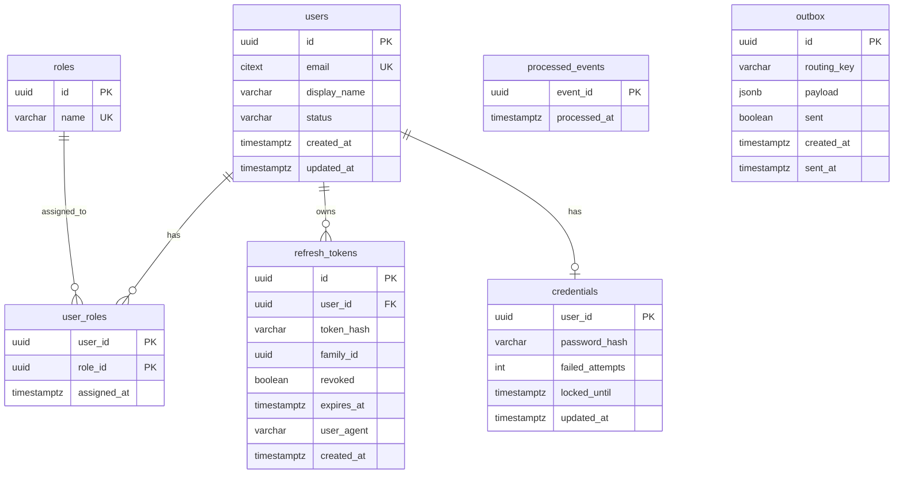

# auth-service — DB Schema (`auth_db`)

## ER diagram



## Prisma sketch

```prisma
model User {
  id          String   @id @default(uuid())
  email       String   @unique               // citext via @db extension
  displayName String   @map("display_name")
  status      String   @default("active")
  createdAt   DateTime @default(now()) @map("created_at")
  updatedAt   DateTime @updatedAt @map("updated_at")
  credential  Credential?
  roles       UserRole[]
  tokens      RefreshToken[]
  @@map("users")
}

model Credential {
  userId         String    @id @map("user_id")
  passwordHash   String    @map("password_hash")
  failedAttempts Int       @default(0) @map("failed_attempts")
  lockedUntil    DateTime? @map("locked_until")
  updatedAt      DateTime  @updatedAt @map("updated_at")
  user           User      @relation(fields: [userId], references: [id], onDelete: Cascade)
  @@map("credentials")
}

model Role {
  id    String     @id @default(uuid())
  name  String     @unique
  users UserRole[]
  @@map("roles")
}

model UserRole {
  userId     String   @map("user_id")
  roleId     String   @map("role_id")
  assignedAt DateTime @default(now()) @map("assigned_at")
  user       User     @relation(fields: [userId], references: [id], onDelete: Cascade)
  role       Role     @relation(fields: [roleId], references: [id])
  @@id([userId, roleId])
  @@map("user_roles")
}

model RefreshToken {
  id        String   @id @default(uuid())
  userId    String   @map("user_id")
  tokenHash String   @map("token_hash")
  familyId  String   @map("family_id")
  revoked   Boolean  @default(false)
  expiresAt DateTime @map("expires_at")
  userAgent String?  @map("user_agent")
  createdAt DateTime @default(now()) @map("created_at")
  user      User     @relation(fields: [userId], references: [id], onDelete: Cascade)
  @@index([userId])
  @@index([familyId])
  @@map("refresh_tokens")
}
```

## Notes

- `email` is **citext** (case-insensitive unique). Enable the `citext` extension in a migration.
- `credentials` split from `users` so the hash is isolated and easy to keep out of query results.
- `refresh_tokens.family_id` enables **rotation-reuse detection**: if a revoked token is presented,
  revoke the whole family.
- `processed_events` + `outbox` are the standard idempotency/outbox tables (every service has them).
- Seed `roles` with `customer` and `admin` in a migration/seed script.
