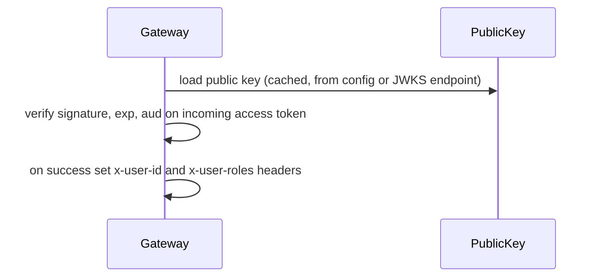

# auth-service — Flows

## Registration

```mermaid
sequenceDiagram
    participant C as Client
    participant G as Gateway
    participant A as auth-service
    participant DB as auth_db
    participant MQ as RabbitMQ

    C->>G: POST /auth/register {email,password,displayName}
    G->>A: forward
    A->>A: validate DTO, password policy
    A->>DB: SELECT user by email
    alt email exists
        A-->>C: 409 EMAIL_ALREADY_EXISTS
    else new
        A->>A: hash password (argon2id)
        A->>DB: BEGIN; insert user+credential+role; insert outbox(user.registered); COMMIT
        A-->>C: 201 {userId, email, roles}
        Note over A,MQ: outbox relay publishes user.registered
        A->>MQ: user.registered
    end
```

## Login

```mermaid
sequenceDiagram
    participant C as Client
    participant A as auth-service
    participant DB as auth_db
    participant MQ as RabbitMQ

    C->>A: POST /auth/login {email,password}
    A->>DB: load user + credential
    alt locked / too many attempts
        A-->>C: 423 ACCOUNT_LOCKED
    else
        A->>A: verify password hash
        alt invalid
            A->>DB: increment failed_attempts (maybe lock)
            A-->>C: 401 INVALID_CREDENTIALS
        else valid
            A->>DB: reset failed_attempts; store refresh token (hashed)
            A->>A: sign access (15m) + refresh (7d)
            A->>MQ: user.logged_in (via outbox)
            A-->>C: 200 {accessToken, refreshToken, expiresIn}
        end
    end
```

## Refresh with rotation & reuse detection

```mermaid
sequenceDiagram
    participant C as Client
    participant A as auth-service
    participant DB as auth_db

    C->>A: POST /auth/refresh {refreshToken}
    A->>A: verify signature + expiry
    A->>DB: find token by hash
    alt not found or revoked
        A->>DB: revoke entire family (possible theft)
        A-->>C: 401 INVALID_REFRESH_TOKEN
    else valid
        A->>DB: mark old token revoked; store new token (same family)
        A->>A: sign new access + refresh pair
        A-->>C: 200 {accessToken, refreshToken, expiresIn}
    end
```

## Token verification path (used by gateway)



The gateway does **not** call auth-service per request — it verifies locally with the public key,
keeping auth off the hot path.
