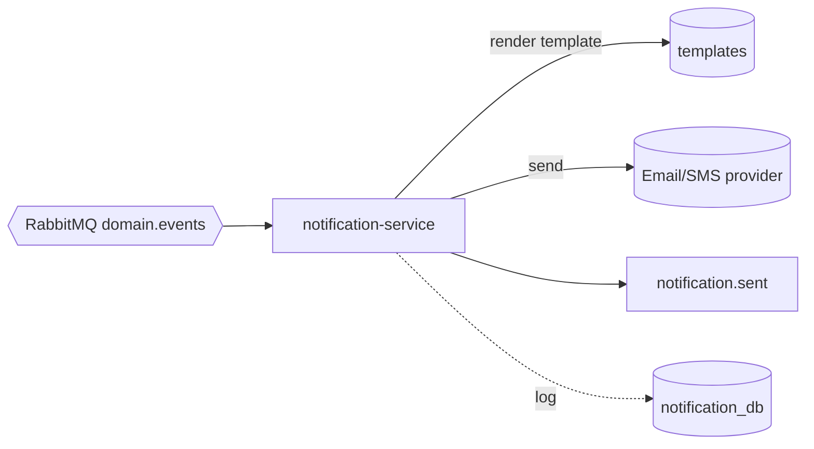

# notification-service — Overview (LATER PHASE)

> **Status: planned, not built in Phase 1.** Stub to fix the event contract now.

## Responsibility

Turn domain events into outbound messages (email, later push/SMS) via an external provider
(SendGrid/Twilio). It is a **pure consumer** — no public REST surface beyond admin/health.

## Owns

- Notification templates and channel config.
- A log of sent notifications (for audit, dedupe, retry).
- User notification preferences (later).

## Trigger model

Subscribes broadly and maps events → templates:

| Event                    | Notification                         |
| ------------------------ | ------------------------------------ |
| `user.registered`        | Welcome email                        |
| `order.created`          | "We received your order" email       |
| `order.confirmed`        | "Order confirmed" email              |
| `order.cancelled`        | "Order cancelled" email              |
| `payment.failed`         | "Payment problem" email              |
| `payment.refunded`       | "Refund issued" email                |
| `product.stock_changed`  | (admin) low-stock alert              |

## DB sketch (`notification_db`)

| Table                | Purpose                                              |
| -------------------- | ---------------------------------------------------- |
| `notifications`      | `id, user_id, channel, template, status, sent_at, error` |
| `templates`          | `id, key, channel, subject, body`                     |
| `preferences`        | `user_id, channel, enabled` (later)                   |
| `processed_events`   | idempotent consumption                                |

## Design notes

- **Idempotent** by `eventId` so a redelivered event doesn't double-send.
- Provider failures retry with backoff; exhausted sends → DLQ + alert.
- Needs the user's email — gets it from `user.registered` payload, or looks it up via auth-service
  (sync) / a local user-email read model. Prefer enriching events with email to avoid a sync hop.
- Emits `notification.sent` for audit/analytics.

## Why it's deferred

It depends on an external provider and on the other services emitting events — both of which are
established in Phase 1. Adding it later requires **only** new queue bindings, not changes elsewhere.

Dispatch detail: [Notification Dispatch](../../03-flows/05-notification-dispatch.md).
