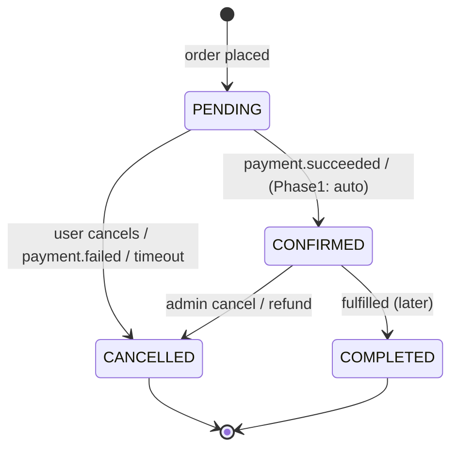

# orders-service — Overview

## Responsibility

Owns the **order lifecycle**: from cart to a placed order through to confirmation/cancellation.
Holds a local **product snapshot** (price/name/stock view) fed by `product.*` events so it never
joins to the product database.

## Owns

- Carts and cart items (optional in Phase 1 — can be client-side; see API doc).
- Orders and order items (with price snapshot at order time).
- Order status and its transitions.
- A read-model snapshot of products (id, name, price, stock view).

## Does NOT own

- Product master data (product-service).
- Payment (payment-service, later) — orders only reacts to `payment.*` events.
- User identity (auth-service) — orders stores only `user_id`.

## Order status model

> **Phase 1 (no payment service):** an order may auto-transition `PENDING → CONFIRMED` on creation,
> or stay `PENDING` until a manual/admin confirm. When payment-service arrives, `CONFIRMED` is
> driven by `payment.succeeded` (see the [Saga](../../03-flows/04-order-payment-saga.md)).

## Key capabilities

| Capability             | Sync API                       | Emits / Consumes                         |
| ---------------------- | ------------------------------ | ---------------------------------------- |
| Create order           | `POST /orders`                 | emits `order.created`                    |
| Get order              | `GET /orders/:id`              | —                                        |
| List my orders         | `GET /orders`                  | —                                        |
| Cancel order           | `POST /orders/:id/cancel`      | emits `order.cancelled`                  |
| (event) Sync products  | —                              | consumes `product.*`                     |
| (event) Payment result | —                              | consumes `payment.*` (later)             |

## Dependencies

- **Postgres** `orders_db`.
- **product-service** (sync) for availability/price validation at checkout.
- **RabbitMQ**: publishes `order.*`; consumes `product.*` (and `payment.*` later).

Related: [API](02-api-spec.md) · [DB Schema](03-db-schema.md) · [Flows](04-flows.md) · [Events](05-events.md)
