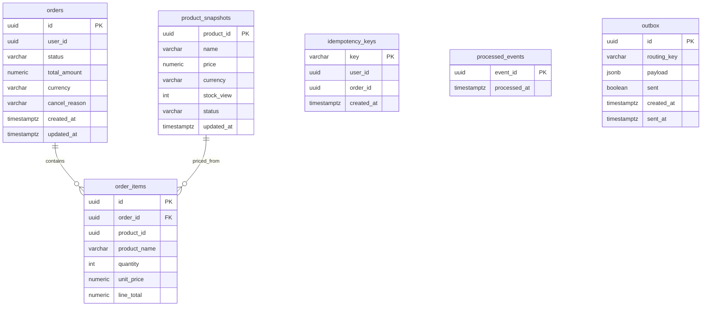

# orders-service — DB Schema (`orders_db`)

## ER diagram



## Prisma sketch

```prisma
model Order {
  id           String      @id @default(uuid())
  userId       String      @map("user_id")
  status       String      @default("PENDING")
  totalAmount  Decimal     @db.Decimal(12, 2) @map("total_amount")
  currency     String      @default("USD")
  cancelReason String?     @map("cancel_reason")
  createdAt    DateTime    @default(now()) @map("created_at")
  updatedAt    DateTime    @updatedAt @map("updated_at")
  items        OrderItem[]
  @@index([userId])
  @@index([status])
  @@map("orders")
}

model OrderItem {
  id          String  @id @default(uuid())
  orderId     String  @map("order_id")
  productId   String  @map("product_id")
  productName String  @map("product_name")
  quantity    Int
  unitPrice   Decimal @db.Decimal(12, 2) @map("unit_price")
  lineTotal   Decimal @db.Decimal(12, 2) @map("line_total")
  order       Order   @relation(fields: [orderId], references: [id], onDelete: Cascade)
  @@index([orderId])
  @@map("order_items")
}

model ProductSnapshot {
  productId String   @id @map("product_id")
  name      String
  price     Decimal  @db.Decimal(12, 2)
  currency  String   @default("USD")
  stockView Int      @default(0) @map("stock_view")
  status    String   @default("active")
  updatedAt DateTime @updatedAt @map("updated_at")
  @@map("product_snapshots")
}
```

## Notes

- `user_id` and `product_id` are **logical references**, not foreign keys — they live in other
  services' databases (principle #1: each service owns its data, no cross-DB FKs).
- `order_items` store a **price snapshot** (`unit_price`, `product_name`) captured at order time, so
  later product price changes never alter historical orders.
- `product_snapshots` is the **read model** maintained by consuming `product.created/updated/stock_changed`.
  It lets checkout validate price/stock locally and avoids a hard sync dependency for reads.
- `idempotency_keys` dedupes double-submitted `POST /orders`.
- Standard `outbox` + `processed_events` tables.
