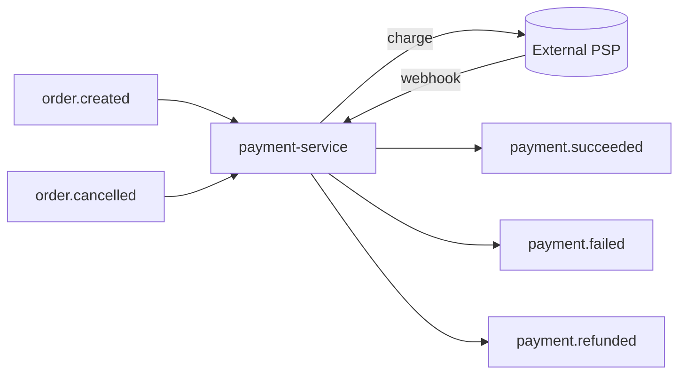
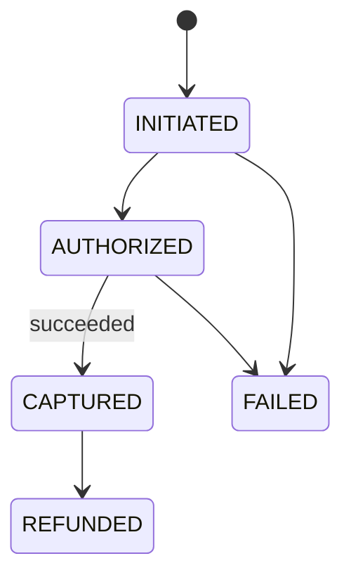

# payment-service — Overview (LATER PHASE)

> **Status: planned, not built in Phase 1.** This stub fixes the contract so Phase-1 services emit
> the right events now and payment can be added later with **no changes** to existing services.

## Responsibility

Handle payment for orders: authorize/capture charges via an external PSP (Stripe/PayPal), record
payment state, issue refunds, and participate in the **order saga**.

## Owns

- Payments (one per order attempt), their status, and PSP references.
- Refunds.
- PSP idempotency keys and webhook event log.

## Trigger model

- **Listens** for `order.created` → initiates a payment with the PSP.
- **Emits** `payment.succeeded` / `payment.failed` → orders-service confirms or cancels.
- **Emits** `payment.refunded` on `order.cancelled` for a paid order.

## Status model

## DB sketch (`payment_db`)

| Table              | Purpose                                                |
| ------------------ | ------------------------------------------------------ |
| `payments`         | `id, order_id, user_id, amount, currency, status, psp_ref, created_at` |
| `refunds`          | `id, payment_id, amount, status, psp_ref, created_at`  |
| `psp_webhook_log`  | raw PSP events for idempotent webhook handling          |
| `outbox`, `processed_events` | standard                                     |

## Why it's deferred

Payment integration adds external dependencies, PCI considerations, and webhook complexity. Phase 1
proves the core domain first. Because `order.created` / `order.cancelled` already carry the needed
data, payment slots in cleanly. See [Order ↔ Payment Saga](../../03-flows/04-order-payment-saga.md).
