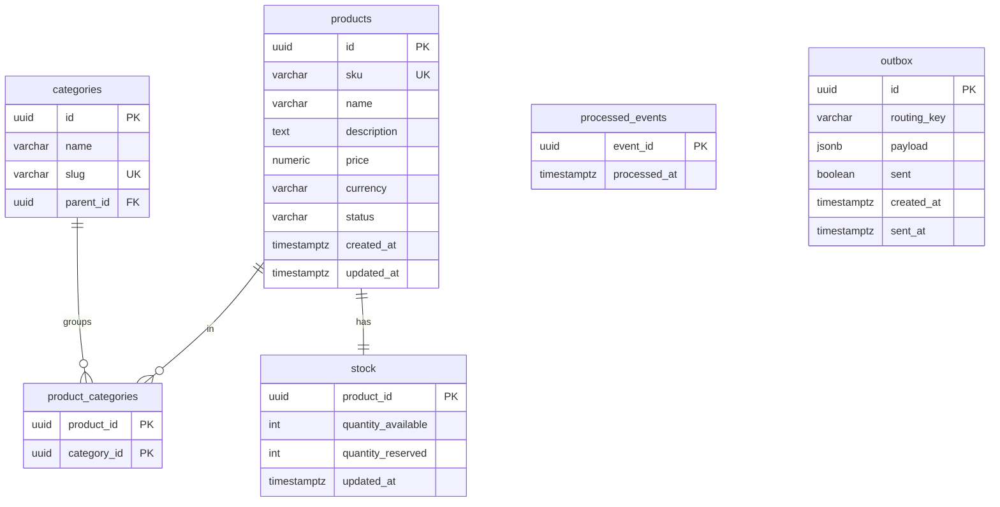

# product-service — DB Schema (`product_db`)

## ER diagram



## Prisma sketch

```prisma
model Product {
  id          String   @id @default(uuid())
  sku         String   @unique
  name        String
  description String?
  price       Decimal  @db.Decimal(12, 2)
  currency    String   @default("USD")
  status      String   @default("active")
  createdAt   DateTime @default(now()) @map("created_at")
  updatedAt   DateTime @updatedAt @map("updated_at")
  categories  ProductCategory[]
  stock       Stock?
  @@index([status])
  @@map("products")
}

model Category {
  id       String   @id @default(uuid())
  name     String
  slug     String   @unique
  parentId String?  @map("parent_id")
  parent   Category? @relation("CategoryTree", fields: [parentId], references: [id])
  children Category[] @relation("CategoryTree")
  products ProductCategory[]
  @@map("categories")
}

model ProductCategory {
  productId  String  @map("product_id")
  categoryId String  @map("category_id")
  product    Product  @relation(fields: [productId], references: [id], onDelete: Cascade)
  category   Category @relation(fields: [categoryId], references: [id], onDelete: Cascade)
  @@id([productId, categoryId])
  @@map("product_categories")
}

model Stock {
  productId         String   @id @map("product_id")
  quantityAvailable Int      @default(0) @map("quantity_available")
  quantityReserved  Int      @default(0) @map("quantity_reserved")
  updatedAt         DateTime @updatedAt @map("updated_at")
  product           Product  @relation(fields: [productId], references: [id], onDelete: Cascade)
  @@map("stock")
}
```

## Notes

- `price` is `Decimal(12,2)` — never a float. Serialized as a string over the wire.
- `stock` split into a separate table so high-frequency stock writes don't churn the product row.
- **Stock safety**: decrements use a conditional update
  `UPDATE stock SET quantity_available = quantity_available - $n WHERE product_id=$id AND quantity_available >= $n`
  (or `SELECT ... FOR UPDATE`) so two concurrent orders can't oversell.
- `quantity_reserved` supports the reservation model used by the order/payment saga later.
- Standard `outbox` + `processed_events` tables for reliable publish + idempotent consumption.
