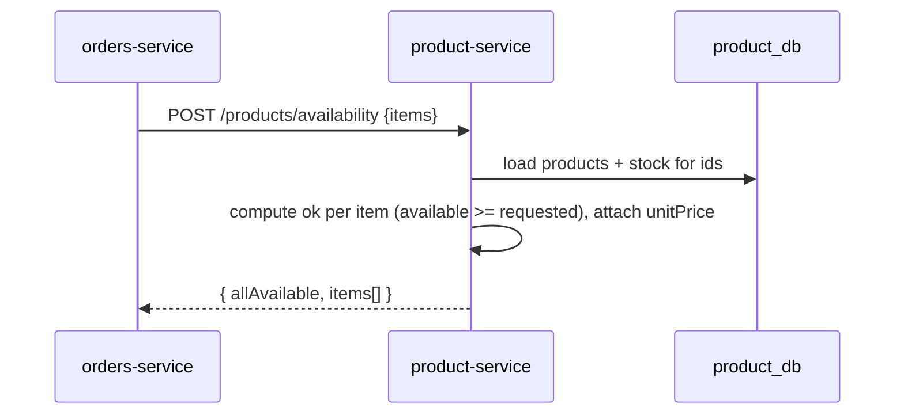
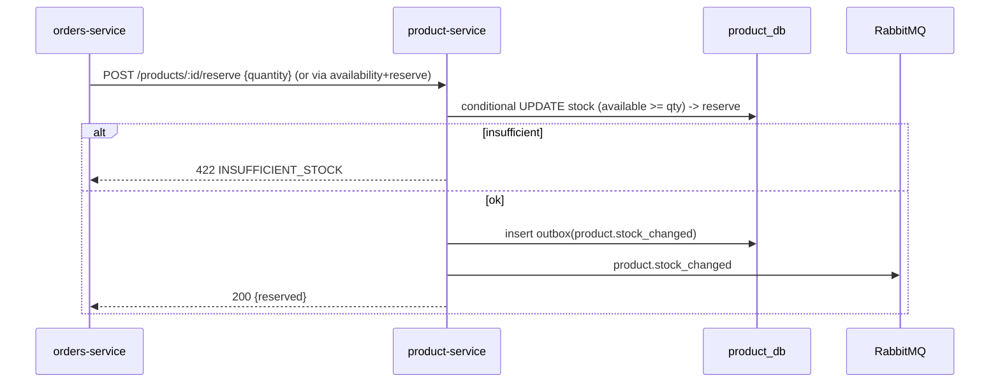

# product-service — Flows

## Create product (admin)

```mermaid
sequenceDiagram
    participant A as Admin
    participant G as Gateway
    participant P as product-service
    participant DB as product_db
    participant MQ as RabbitMQ

    A->>G: POST /products (admin token)
    G->>G: verify JWT + role=admin
    G->>P: forward (x-user-roles: admin)
    P->>P: RolesGuard(admin), validate DTO
    P->>DB: check SKU unique
    alt SKU exists
        P-->>A: 409 SKU_ALREADY_EXISTS
    else
        P->>DB: BEGIN; insert product + stock; insert outbox(product.created); COMMIT
        P->>MQ: product.created (via relay)
        P-->>A: 201 {product}
    end
```

## Availability check (called by orders at checkout)



## Stock decrement on order (reservation)

> In Phase 1 (no payment), the order flow may reserve/decrement stock at order creation. The exact
> point is finalized in [Place Order](../../03-flows/03-place-order.md).



## Release stock on cancellation (event consumer)

```mermaid
sequenceDiagram
    participant MQ as RabbitMQ
    participant P as product-service
    participant DB as product_db

    MQ->>P: order.cancelled {items}
    P->>DB: dedupe by eventId (processed_events)
    alt already processed
        P->>MQ: ack (no-op)
    else
        P->>DB: BEGIN; release reserved qty back to available;<br/>insert outbox(product.stock_changed); record processed_events; COMMIT
        P->>MQ: product.stock_changed + ack
    end
```
