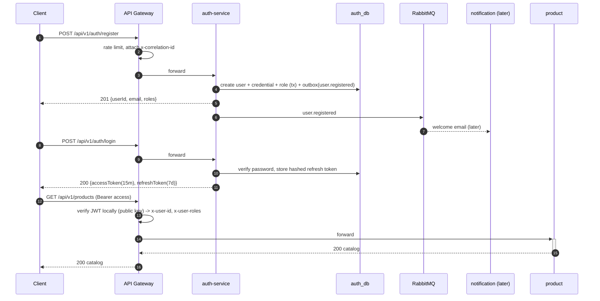
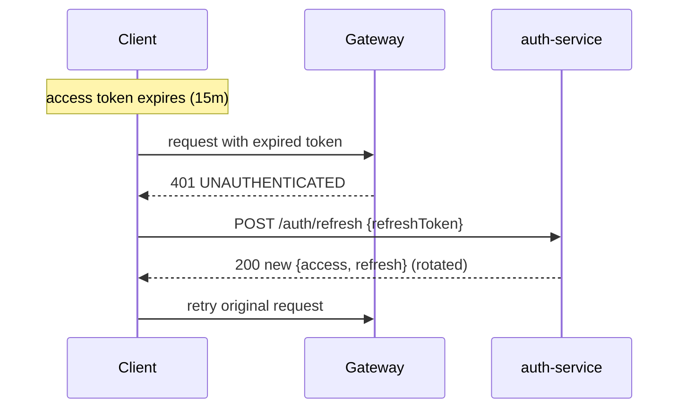

# Flow 01 — Registration & Login

End-to-end identity flow across gateway and auth-service. Service-local detail lives in
[auth flows](../02-services/auth/04-flows.md); this is the cross-service view.

## Happy path: register then login

## Token lifecycle

## Failure cases

| Case                       | Where        | Result                                  |
| -------------------------- | ------------ | --------------------------------------- |
| Duplicate email            | auth-service | `409 EMAIL_ALREADY_EXISTS`              |
| Wrong password             | auth-service | `401 INVALID_CREDENTIALS` (+ attempt++) |
| Too many attempts          | auth-service | `423 ACCOUNT_LOCKED`                    |
| Expired access token       | gateway      | `401 UNAUTHENTICATED` → client refreshes|
| Reused/revoked refresh     | auth-service | `401` + revoke token family             |
| Login flood                | gateway      | `429 RATE_LIMITED`                      |
