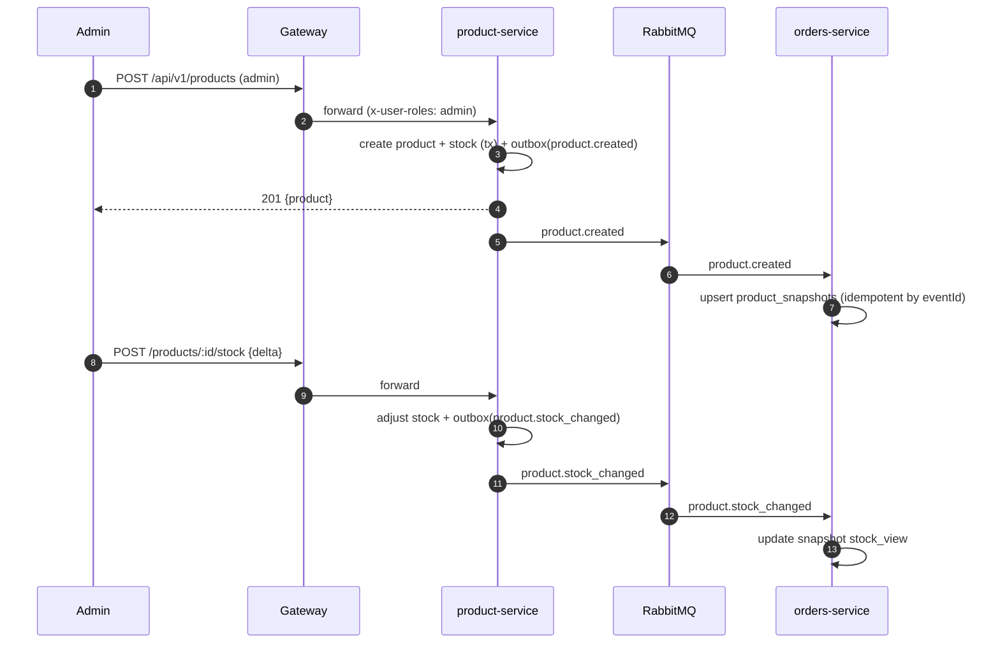

# Flow 02 — Browse Catalog

How a customer browses products, and how the catalog is populated by admins. Mostly synchronous and
read-heavy.

## Customer browsing

```mermaid
sequenceDiagram
    autonumber
    participant C as Client
    participant G as Gateway
    participant P as product-service
    participant DB as product_db

    C->>G: GET /api/v1/products?page=1&amp;limit=20&amp;category=X&amp;q=text
    G->>G: optional verify token, rate limit
    G->>P: forward
    P->>DB: query products + stock (paginated, filtered)
    P-->>G: 200 catalog page with pagination meta
    G-->>C: 200 catalog page

    C->>G: GET /api/v1/products/:id
    G->>P: forward
    P->>DB: load product + categories + stock
    P-->>C: 200 product detail
```

Notes:
- Browsing can be **anonymous** (public) or require auth — decided per deployment at the gateway.
- List endpoints are **cacheable** (ETag / short TTL) since catalog changes are infrequent.

## Admin creates a product → snapshot propagates to orders

This is the key cross-service piece: orders-service keeps a **local snapshot** so it never queries
product_db.



## Why the snapshot matters

When the customer later places an order (Flow 03), orders-service can validate price/stock against
its **own** snapshot first, and confirm with a single sync availability call — instead of being
hard-coupled to product-service for every read. See [Place Order](03-place-order.md).
