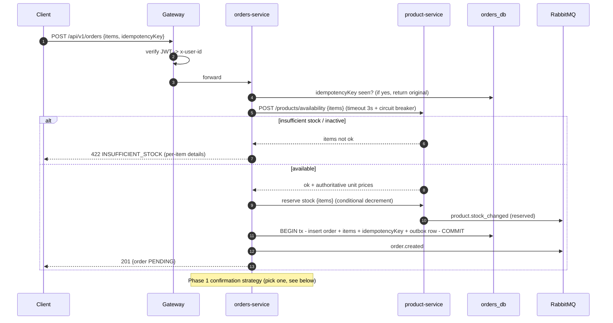
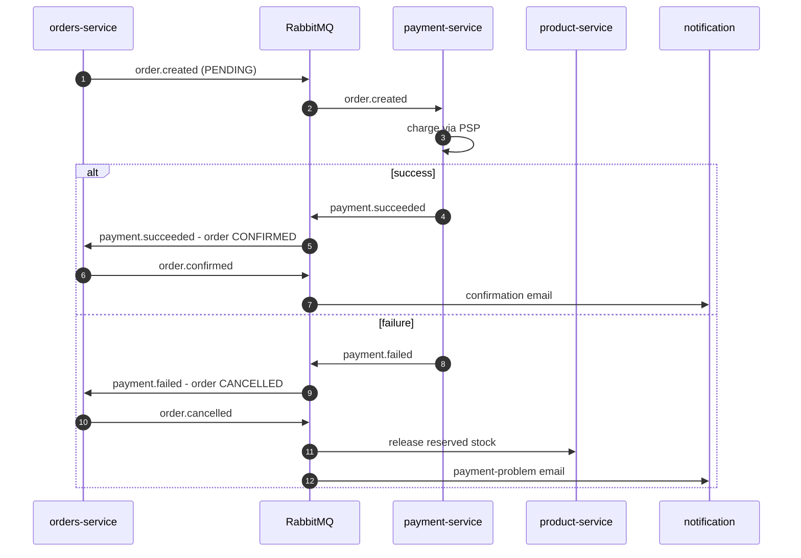

# Flow 03 — Place Order

The headline Phase-1 journey. Combines a synchronous availability check with asynchronous event
emission. Shown first **without** payment (Phase 1), then how payment plugs in.

## Phase 1 — place order (no payment service)

### Phase-1 confirmation strategy

Because there is no payment yet, choose one (recorded as a decision; default = **auto-confirm**):

| Strategy        | Behavior                                              | Pro / Con                          |
| --------------- | ----------------------------------------------------- | ---------------------------------- |
| **Auto-confirm**| Order created directly as `CONFIRMED` (+`order.confirmed`) | Simplest demo; least realistic |
| Manual confirm  | Stays `PENDING`; admin calls `/confirm`               | Mirrors real flow; needs admin     |
| Mock payment    | A stub emits `payment.succeeded` after a delay        | Closest to final; extra moving part|

> The stock-reserve step is included so the model is already saga-ready. If you prefer maximum
> Phase-1 simplicity, stock can instead be decremented outright and released on cancel.

## With payment (later) — preview

Full saga with compensation: [Order ↔ Payment Saga](04-order-payment-saga.md).

## Failure & edge cases

| Case                              | Handling                                                       |
| --------------------------------- | -------------------------------------------------------------- |
| product-service down              | Circuit breaker opens → `503 DEPENDENCY_UNAVAILABLE`, no order |
| Stock taken between check+reserve | Reserve is conditional → `422 INSUFFICIENT_STOCK`              |
| Double submit                     | `idempotencyKey` returns the original order                    |
| order.created lost                | Outbox guarantees eventual publish                             |
| Duplicate order.created delivered | Consumers dedupe by `eventId`                                  |
