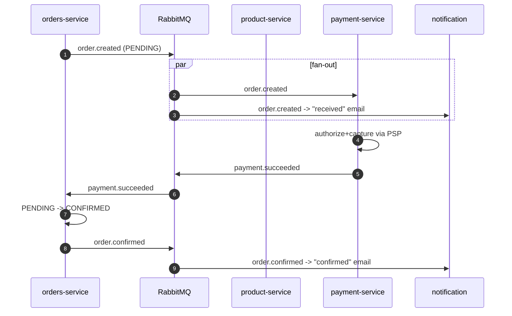
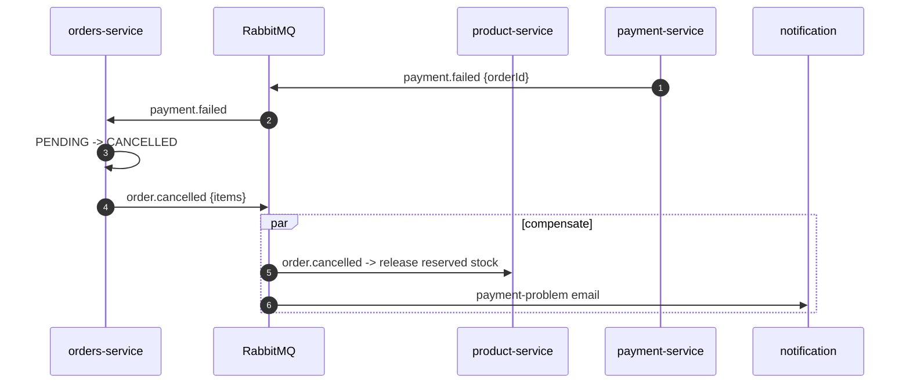
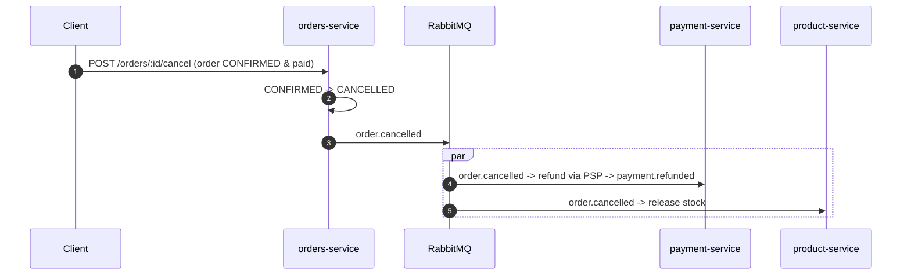

# Flow 04 — Order ↔ Payment Saga (LATER PHASE)

A **choreographed saga** (no central orchestrator): each service reacts to events and runs
compensating actions on failure. This realizes cross-service consistency without distributed
transactions.

## Participants & their local transactions

| Step | Service          | Local action                         | On failure → compensation        |
| ---- | ---------------- | ------------------------------------ | -------------------------------- |
| 1    | orders-service   | Create order `PENDING`, reserve req. | —                                |
| 2    | product-service  | Reserve stock                        | Release stock (on cancel)        |
| 3    | payment-service  | Charge via PSP                       | Refund (on later cancel)         |
| 4    | orders-service   | `CONFIRMED` on success               | `CANCELLED` on payment failure   |

## Success path

## Failure path (payment fails) — compensation

## Cancellation after payment (refund)

## Saga invariants

- Every forward action has a defined compensation.
- All steps are **idempotent** (replayed events are safe).
- Timeouts: if `payment.*` never arrives within a TTL, a scheduled job cancels the order
  (`order.cancelled`) and compensations run — no order is stuck `PENDING` forever.
- The saga is **eventually consistent**: there are brief windows where order/payment/stock disagree;
  events converge them.

## Why choreography (not orchestration) for now

Choreography keeps services decoupled and needs no extra orchestrator component. If the workflow
grows complex (many branches/timeouts), revisit with an orchestrator (e.g. a `saga-orchestrator`
service or a workflow engine) — captured as a future ADR.
