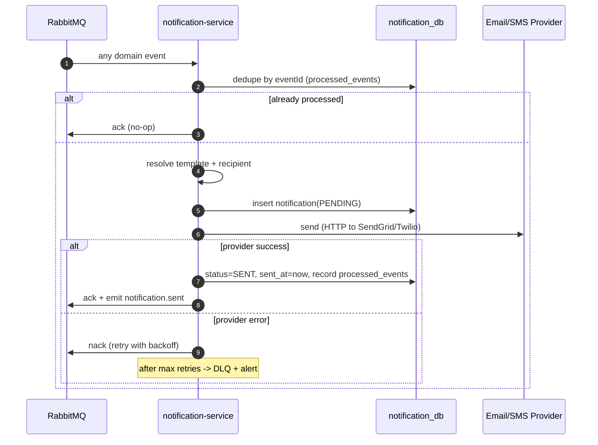

# Flow 05 — Notification Dispatch (LATER PHASE)

How notification-service processes domain events and dispatches outbound messages. Pure consumer
— no sync path.

## Generic dispatch pattern

## Event → notification mapping

| Event                   | Channel | Template key           | Recipient       |
| ----------------------- | ------- | ---------------------- | --------------- |
| `user.registered`       | email   | `welcome`              | event.email     |
| `order.created`         | email   | `order_received`       | look up by userId |
| `order.confirmed`       | email   | `order_confirmed`      | look up by userId |
| `order.cancelled`       | email   | `order_cancelled`      | look up by userId |
| `payment.failed`        | email   | `payment_problem`      | look up by userId |
| `payment.refunded`      | email   | `refund_issued`        | look up by userId |
| `product.stock_changed` | email   | `low_stock_admin_alert`| configured admin email |

> `user.registered` carries email in the payload — no lookup needed.
> For other events, notification-service must either receive email in the event payload (preferred)
> or call auth-service GET /users/:id (sync fallback). **Prefer enriching events.**

## Recipient resolution

Recommendation: enrich the `order.created` / `order.cancelled` / `payment.*` event payloads with
`userEmail` at the producer (orders-service/payment-service reads it from its own snapshot or from
the JWT claims). This avoids a sync hop in notification-service entirely.

## Template storage

Templates live in `notification_db.templates` (key, channel, subject, body with `{{placeholders}}`).
Rendered server-side (Handlebars or similar). Allows admin updates without redeploy.

## Retry & DLQ behaviour

- Transient provider error → nack → retry queue (exponential backoff, max 5 attempts).
- Provider confirms delivery → ack.
- Hard failure / invalid template → DLQ (don't retry; fix the template).
- Duplicate delivery (reuse of same eventId) → dedupe, ack, no-op.
