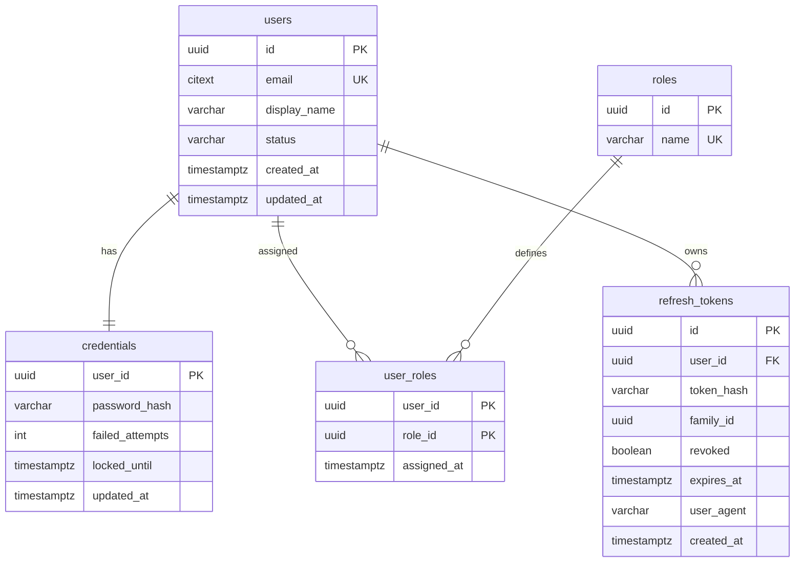
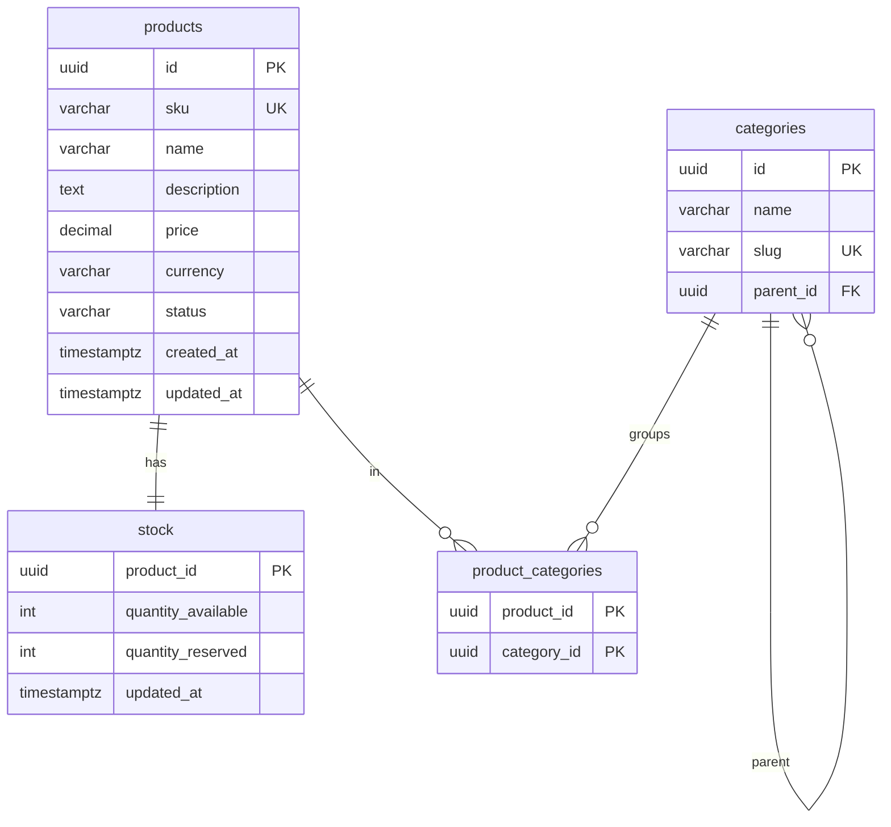
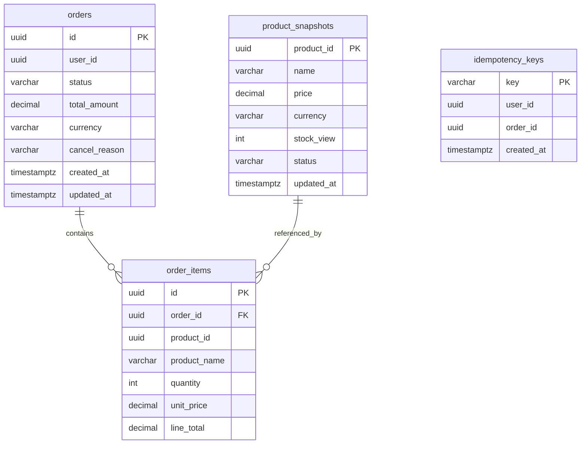
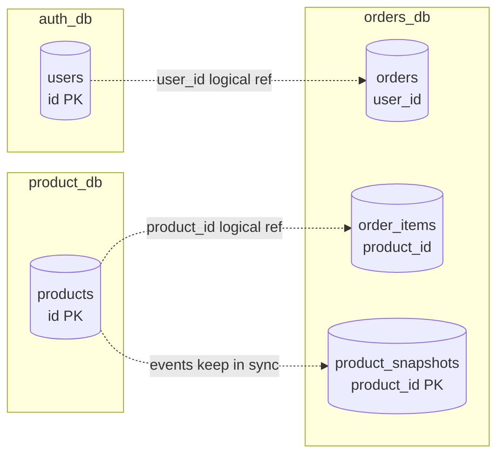

# 02 — ER Diagrams

One diagram per service database. Cross-service references are shown as dotted logical references
(not foreign keys — they live in different databases).

## auth_db

## product_db

## orders_db

## Cross-service logical references

Dotted arrows = logical references only — no database-level FK. Integrity is maintained at the
application layer via event consistency, not DB constraints.

